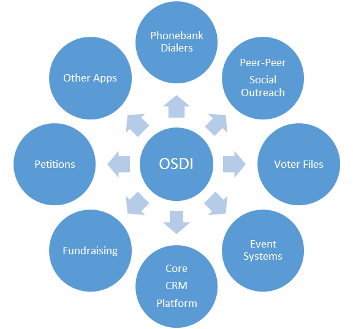

The Open Supporter Data Interface (OSDI) effort seeks to define an API and data structures for interoperability among products in the **progressive** cause-based, campaign and non-profit marketplace. The existence of a common API will reduce customer costs related to moving data between different systems, lower integration costs and enhance the ability of innovators to create products for the marketplace.

OSDI membership is made up of progressive vendors and organizations as well as invited non-partisan and mainstream industry vendors.

The API will define interfaces including but not limited to resources representing people, donations, questions, tags, and events. The group will determine the order in which to define resource models and which version of the API to include them in.

**Benefits of a Common API**

Customers, digital and tech directors, technology consultants

* Less manual and error-prone data import/export
* Staff and Volunteer data entry time savings
* Better ability to pick and choose technology products and use them together
* Multi-Vendor solutions mean less headaches

Technology Application Developers

* Write platform integration code once rather than per platform means less dev hours spent
* Data consistency across platforms reduces cost
* Can spend more resources on new customer features rather than integration code

Platform Vendors

* Ability to integrate means an easier sell to customers who already use another platform.
* Common API across vendors enables a larger app ecosystem for your platform

[Read the full charter](charter.md)

[Read our scenarios document](scenarios/scenarios.md)

[Download a one page PDF about the project](docs/osdi-one-pager.pdf)

[Experiment with our prototype http://api.opensupporter.org](http://api.opensupporter.org)

[Join our reviewers email group to stay up to date: http://signup.opensupporter.org](http://signup.opensupporter.org)

[**Please Fill out our survey**](https://docs.google.com/forms/d/1YazUaISNvH_j2p4rfv7eKcbq4CLjaGuszDnTFxA4Gcw/viewform)

Please give us feedback on our work. [Read the Review Guide](review_guide.md) to learn what kind of feedback we're looking for and how to provide it.

# Authors
* Tim Anderegg, New Organizing Institute (NOI)
* Topper Bowers, Amicus
* Jeff Crigler, Catalist
* Josh Cohen, Washington United For Marriage (Editor)
* Tim Gutowski, Trilogy Interactive
* Mark Paquette, TheDataBank
* Charles Parsons, Salsa Labs
* Jason Rosenbaum, The Action Network
* Ben Stein, Mobile Commons
* Ray Suelzer, UFCW International Union
* Brian Vallelunga, Trilogy Interactive
* Nathan Woodhull, ControlShift Labs
* Misha Zhurkin, Catalist

> This effort is currently in an exploratory phase to determine if consensus on a common API can be achieved.  The involvement of a person or company does not reflect a commitment to implement this API.

# Contact Info
Website: [http://opensupporter.org](http://opensupporter.org)

Email: [info@opensupporter.org](mailto:info@opensupporter.org)

# API Data Model

## Beta Stability Level
* [API Entry Point](aep.md)
* [People and Addresses](people.md)

## Experimental Stability Level
* [Lists](lists.md)
* [Survey Questions and Answers](questions.md)
* [Events](events.md)
* Donations
* [Canvassing Interactions](interactions.md)

# Basic Resource Access
## API Entry Point and linking
All access through OSDI starts at the API Entry Point (AEP).  The AEP is a resource that acts like a directory of the types of resources available on a server.  It also includes capability information like the maximum query pagesize.

Some servers may support some or all of the different resource collections.  For example, a peer to peer donation system might support Donations and People but not events.  In order to find out what resources are available and what URIs to use to access them, do a GET on the AEP URI.

Your service provider can tell you what the AEP URI is for your account.

For the purposes of example, assume your provider has given you an AEP URI of

[http://api.opensupporter.org/api/v1](http://api.opensupporter.org/api/v1)

> Note: you can explore the AEP with a user friendly interface by visiting our [prototype endpoint](http://api.opensupporter.org)

In order to determine the available resources on the server the client should perform an HTTP GET request to this URI.

Within the response will be a collection of links to the resource collections available on the server.

Request

	GET /api/v1 HTTP/1.1
	Host: api.opensupporter.org

Response

	200 OK
	Content-Type: application/json

	{
	  "motd": "Welcome to the ACME Action Platform OSDI API endpoint!!",
	  "_links": {
	    "people": {
	      "href": "/api/v1/people",
	      "title": "The collection of people in the system"
	    },
		"people_lists": {
	      "href": "/api/v1/people_lists",
	      "title": "The collection of people in the system"
	    },
	    "addresses": {
	      "href": "/api/v1/addresses",
	      "title": "The collection of addresses in the system"
	    },
	    "questions": {
	      "href": "http://api.opensupporter.org/api/v1/questions",
	      "title": "The collection of questions in the system"
	    },
	    "question_answers": {
	      "href": "http://api.opensupporter.org/api/v1/question_answers",
	      "title": "The collection of question answers in the system"
	    },
	    "self": {
	      "href": "/api/v1",
	      "title": "The root API Entry Point (Your are here)"
	    },
	    "docs": {
	      "href": "https://github.com/wufm/osdi-docs",
	      "title": "Documentation:",
	      "name": "Docs",
	      "index": "index"
	    }
	  }
	}

Given the above example response, let's fetch the people collection on this server.
Notice the "_links" collection.  Find the object in the links collection with key "people".  That object has an attribute "href" which contains the URI to use to access the people collection.

> This is for example purpose only.  The official definition of the person schema is [People and Addresses](people.md)

Request

	GET /api/v1/people HTTP/1.1

Response

    {
    	  "total_records": 80,
    	  "total_pages": 16,
    	  "page" : 2,
    	  "_links": {
    		"next" : {
    			"href" : "http://api.opensupporter.org/api/v1/people?page=3&per_page=5"
    			},
    		"previous" : {
    			"href" : "http://api.opensupporter.org/api/v1/people?page=1&per_page=5"
    			}
    		},
    	  "_embedded": {
    	    "people": [
             {
                "first_name": "Edwin",
                "last_name": "Labadie",
                "middle_name": "Marques",
                "email": "test-3@example.com",
                "gender": "Male",
                "gender_identity": "Transgender Male",
                "party": "Democrat",
                "source": "sed",
                "source_details": "Delectus rerum autem mollitia sit asperiores odit hic cum.",
                "twitter_handle": "@Edwin_Labadie",
                "guid": "c1d9c510-b562-0130-dc7c-168c51e904de",
                "_embedded": {
                  "primary_address": {
                    "address1": "935 Ed Lock",
                    "city": "New Dudley",
                    "state": "MN",
                    "postal_code": "17678",
                    "country_code": "RU",
                    "address_type": "Home",
                    "location" : {
             		   "longitude" : "40.1",
             		   "latitude" : "44.5"4,
             		   "accuracy": "Rooftop"
             		 },
                    "address_status": "Verified",
                    "primary": true,
                    "_links": {
                      "self": {
                        "href": "http://api.opensupporter.org/api/v1/addresses/46"
                      },
                      "person": {
                        "href": "http://api.opensupporter.org/api/v1/people/23"
                      }
                    }
                  },
                  "addresses": [
                    {
                      "address1": "28160 Wiegand Divide",
                      "city": "Lake Amarimouth",
                      "state": "GA",
                      "postal_code": "27585-7257",
                      "country_code": "US",
                      "address_type": "Work",
                      "location" : {
             		      "longitude" : "40.1",
             		      "latitude" : "44.5"4,
             		      "accuracy": "Rooftop"
             		   },
                      "address_status": "Verified",
                      "primary": false,
                      "_links": {
                        "self": {
                          "href": "http://api.opensupporter.org/api/v1/addresses/45"
                        },
                        "person": {
                          "href": "http://api.opensupporter.org/api/v1/people/23"
                        }
                      }
                    },
                    {
                      "address1": "935 Ed Lock",
                      "city": "New Dudley",
                      "state": "MN",
                      "postal_code": "17678",
                      "country_code": "RU",
                      "address_type": "Home",
                      "location" : {
             		      "longitude" : "40.1",
             		      "latitude" : "44.5"4,
             		      "accuracy": "Rooftop"
             		   },
                      "address_status": "Verified",
                      "primary": true,
                      "_links": {
                        "self": {
                          "href": "http://api.opensupporter.org/api/v1/addresses/46"
                        },
                        "person": {
                          "href": "http://api.opensupporter.org/api/v1/people/23"
                        }
                      }
                    }
                  ]
                },
                "_links": {
                  "addresses": {
                    "href": "http://api.opensupporter.org/api/v1/people/23/addresses"
                  },
                  "question_answers": {
                    "href": "http://api.opensupporter.org/api/v1/people/23/question_answers"
                  },
                  "self": {
                    "href": "http://api.opensupporter.org/api/v1/people/23"
                  }
                }
              }
            .... other person records follow
           }
        }

In the last example message, the server returns a list of people.  For brevity this document only shows the first one.  Within each person object, there is also a "_links" collection just like in the AEP.  This will show up in most objects in OSDI.  The links collection lets the client know what other resources and resource collections are associated with a given object.

In this example, the link shown is "addresses".  The href attribute of the "addresses" link contains the URI of the address collection *for this person*.

     "_links": {
              "addresses": {
                "href": "http://api.opensupporter.org/api/v1/people/23/addresses"
              }

A client can send a GET request to this URI to retrieve a list of addresses associated with this person.

    GET /api/v1/people/23/addresses

    200 OK
    Content-Type: application/json

    {
      "total_pages": 1,
      "page": 1,
      "total_records": 2,
      "_embedded": {
        "addresses": [
          {
            "address1": "28160 Wiegand Divide",
            "city": "Lake Amarimouth",
            "state": "GA",
            "postal_code": "27585-7257",
            "country_code": "US",
            "address_type": "Work",
            "location" : {
               "longitude" : "40.1",
             	"latitude" : "44.5"4,
             	"accuracy": "Rooftop"
             },
            "address_status": "Verified",
            "primary": false,
            "_links": {
              "self": {
                "href": "http://api.opensupporter.org/api/v1/addresses/45"
              },
              "person": {
                "href": "http://api.opensupporter.org/api/v1/people/23"
              }
            }
          },
          {
            "address1": "935 Ed Lock",
            "city": "New Dudley",
            "state": "MN",
            "postal_code": "17678",
            "country_code": "RU",
            "address_type": "Home",
            "location" : {
             	"longitude" : "40.1",
             	"latitude" : "44.5"4,
             	"accuracy": "Rooftop"
             },
            "address_status": "Verified",
            "primary": true,
            "_links": {
              "self": {
                "href": "http://api.opensupporter.org/api/v1/addresses/46"
              },
              "person": {
                "href": "http://api.opensupporter.org/api/v1/people/23"
              }
            }
          }
        ]
      },
      "_links": {
        "self": {
          "href": "http://api.opensupporter.org/api/v1/addresses"
        }
      }
    }

Note that this pattern can be applied to other associated collections including but not limited to donations or question_answers.

## HAL

OSDI has embraced the [JSON+HAL spec](http://tools.ietf.org/html/draft-kelly-json-hal-05).  JSON+HAL specifies a simple way to embed linking into APIs.  The combination of linking and a specification allows generic clients to be written and, indeed, [many languages have HAL clients](http://stateless.co/hal_specification.html).  Linking itself makes it easier to both reason about and write clients for an API.

By default, server responses should expand first level instances unless otherwise specified.  For example, in a response for a collection of resources, those resources should be embedded.

## Common CRUD operations
### Creating a Resource
Creating a new resource involves adding a new item to a collection.  To create a new resource, an HTTP POST message is sent to the URI for a collection.

    POST <addURI> HTTP/1.1
    Host: ...
    Accept: application/...
    Content-Type: application/...

    <serialization of request to create a new resource>

    HTTP/1.1 201 Created
    Location: ...
    Content-Type: application/...

    <serialization of new resource>

#### Insert or Update (Upsert)
In some cases, the client doesn't know if a resource exists or not.  Instead of first having to query a resource to determine if it exists and then do an update via PUT, the client may use the upsert feature.

When used, the server will use a matching algorithm to determine if the input attributes match an existing record.

> The algorithm used by the server to perform matching is vendor-specific.  Contact your vendor for specifics.

To use the upsert feature, the $upsert query parameter is appended to the URI.  Its value is either true or false

> If the upsert parameter is not included, it defaults to TRUE.  The server will attempt a match to an existing resource first, but if if cannot find one, a new resource will be created.

	POST <addURI>?upsert=false HTTP/1.1
    Host: ...
    Accept: application/...
    Content-Type: application/...

    <serialization of potential new resource>

If the resource does not exist, then a 201 response is returned

    HTTP/1.1 201 Created
    Location: ...
    Content-Type: application/...

    <serialization of new resource>

If the resource does already exist, then a 200 response is returned

 	HTTP/1.1 200 OK
    Location: ...
    Content-Type: application/...

    <serialization of existing resource>

### Retrieving a Resource
Retrieving a resource gets a representation of a resource instance or resource collection.  The retrieval is performed with an HTTP GET sent to the URI of the resource.

Request

    GET <ResourceURI> HTTP/1.1
    Host: ...
    Accept: application/...

Response

    HTTP/1.1 200 OK
    Content-Type: application/...

    <serialization of resource>

#### Collection Responses

When retrieving collections, the response representation will include some common attributes.

|Name			|Type		| Description
|-----------	|-----------|------------------------
|total_pages			|integer	|The number of pages applicable to this query
|total_records	|integer	|The total number of resources matching this query
|page			|integer	|The page number of this response

##### Prev/next
Collection responses may include additional links for navigation to previous and next pages

|Name		|Type		| Description
|-----------|-----------|------------------------
|next		|			|the link for the next page of results
|previous	|			|the link for the previous page of results

### Updating a Resource
Updating a resource instance is accomplished by the use of an HTTP PUT sent to the URI of a given resource.  Due to the complexity of full-resource updates involving read-only properties, out-of-date data, and the need to know all properties (which one may not), this specification focuses on the ability to make partial updates to resources.

To make an update to a resource, the client sends an HTTP PUT to the URI of a resource instance.  The body of the put contains a partial resource representation including the attributes to update.  Missing attributes are left unchanged on the Provider side.

Clients may set an attribute to nil by including the attribute using ‘nil’ for JSON.

> Updating Collections with PUT is not supported.

    PUT <editURI> HTTP/1.1
    Host: ...
    Accept: application/...
    Content-Type: application/...

    <serialization of request to update a resource>

    HTTP/1.1 200 OK
    Content-Type: application/...

    <serialization of updated resource>

    The HTTP response body shall contain the serialization of the updated resource

## Selecting Results
### Filtering Collections
When retrieving representations of a collection, clients may include filters expressed as query parameters.  The $filter query parameter is used for this purpose.  The $filter parameter value shall contain an expression using the following operators:

        '<', '<=', '=', '>=', ">', '!=' : Integer and date value/attribute
        '=', '!='                       : String value/attribute

Example:
Assuming a resource of ‘Person’ which has an attribute named ‘firstName’, the following filter would return resources with first name of ‘Jon’

        $filter=first_name=’Jon’

### Pagination
The parameters $per_page and $page control pagination.

* $per_page specifies how many results to return per page
* $page specifies the starting page to start with.

### Expand / Mixins
In order to optimize access, the $expand query parameter can be used to expand collections within resources.  Normally when retrieving a resource instance, subordinate collections are returned as references.

When the $expand parameter is used, the collection corresponding to the parameter value shall be expanded to represent the collection of instances.

When this parameter is used in requests for Collections, the value applies to the resources enclosed in the collection rather than the collection itself.

Example

Assuming a resource of Person with a collection of addresses, $expand=addresses would cause the collection of instances of addresses to be returned rather than a reference.

## Common Attributes
All resources have a set of common attributes.  These are present, even if the table definitions do not explicitly list them.

### Common Attributes

| Name          | Type      | Description
|-----------    |-----------|--------------
|created_at	    |datetime   |The date and time the resource was created on the local system
|modified_at		|datetime	|The date and time the resource was last modified on the local system

## Notational Conventions

In this specification, when defining models, the following notational conventions are used.

|Convention	|Description
|:-----------:|--------------
|type[]     | A reference to a collection of resources of type 'type'
|	type*	| A reference to a single resource of type 'type'
|	string	| A string
|	datetime| A date and time representation.  In JSON this is a string.  The contents of this attribute shall be  ISO 8601 
| hash	| A complex attribute represented by a JSON hash

In the description of string types, sometimes the specification will list a set of acceptable values such as

| Name		| Type		| Description
|-----------|-----------|------------------
| gender	| string	| one of "Male", "Female", "Other" |

In these cases, the string value should conform to one of the choices unless specified otherwise
